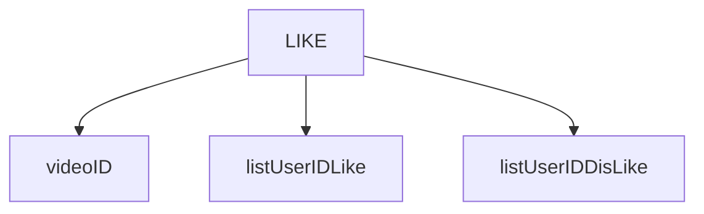

- Search voice feature
- your videos page (delete video, add video)
- animation when click to icon
- fix font family, font weight, icon
- search be
- pagination be
- real-time comment (SWR)
- refresh token
- search real-time
- lazy load
- scroll bar
- loading
- overlay
- active category
- subscribe
- view counter
- show more description video
- fix title video when responsive
- fix desktop layout list videos
- create unique videoID
  > 1. LIKE

> 1 User luu video da like , unlike
